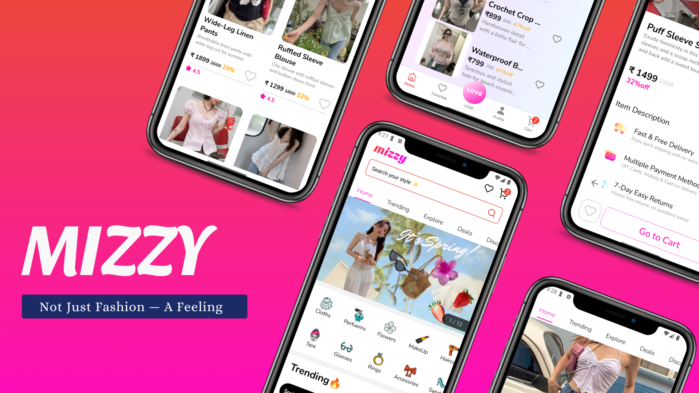

# ✨ Mizzy — Girly Fashion Shopping App

**Mizzy** is a soft-styled shopping MVP focused on girly fashion and accessories.  
It’s the **first app** in my journey to build **100 Emotionally Designed MVPs** — building real, love-inspired products that feel special.

🎬 [Watch Demo on YouTube](https://youtu.be/zvsqy1Lg3GQ?feature=shared)  
📱 [Watch Insta Reel](https://www.instagram.com/p/REPLACE_THIS)

---

## 🌸 Features

- 🛍️ Fashion product catalog (girly-themed)
- 🔒 Firebase Authentication (email/password)
- 🔁 Infinite scroll with **TanStack Query**
- 💖 Optimistic likes & cart actions
- 💅 Soft UI with subtle animations
- 🔐 Firestore backend for user & product data

---

## 🖼️ Banner Preview

> *(One image is enough — perfect for mobile-first projects)*



---

## 🧠 Tech Stack

- **React Native (Expo)**
- **Firebase** (Auth, Firestore)
- **TanStack Query** – Infinite scrolling & optimistic UI
- **React Native Paper**
- **Reanimated**, **Expo Tab View**, **Gradient**, **Carousel**

---

## 🛠️ Setup Instructions

```bash
git clone https://github.com/bharat2005/mizzy-app.git
cd mizzy-app
npm install
npx expo start

